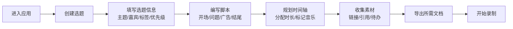

## 1. 产品概述

播客主播规划工具是一款面向播客创作者的单页Web应用，帮助主播完成从选题策划到录制准备的全流程规划。无需登录即可在浏览器中使用，所有数据存储在本地。

- **核心价值**：提供一站式播客制作规划体验，整合选题管理、脚本编写、时间把控、素材管理和导出功能
- **目标用户**：播客主播、内容创作者、自媒体人
- **解决痛点**：分散的工具使用导致流程混乱，缺乏系统化的播客制作规划体验

## 2. 核心功能

### 2.1 用户角色
| 角色 | 注册方式 | 核心权限 |
|------|----------|----------|
| 访客用户 | 无需注册 | 使用全部功能，数据本地存储 |

### 2.2 功能模块
1. **选题板**：看板管理选题，支持拖拽状态流转、嘉宾信息、标签和优先级设置
2. **脚本编辑**：分模块编写脚本（开场、问题、广告、结尾），支持折叠展开
3. **时间轴**：可视化时间管理，估算每段时长，标记音乐和口播位置
4. **素材清单**：管理链接、引用来源、待确认事项
5. **导出区**：一键生成录制提纲、嘉宾问题单、发布简介

### 2.3 页面详情
| 页面名称 | 模块名称 | 功能描述 |
|---------|----------|----------|
| 主页面 | 选题板 | 新增/编辑/删除选题，拖拽切换状态（待开发/进行中/已完成），设置嘉宾、标签、优先级 |
| 主页面 | 脚本编辑 | 按开场、问题、广告、结尾分块，支持添加段落、折叠展开、字数统计 |
| 主页面 | 时间轴 | 可视化时间条，添加时段节点，标记音乐/口播，自动计算总时长 |
| 主页面 | 素材清单 | 分类管理素材（链接/引用/待办），添加备注，标记完成状态 |
| 主页面 | 导出区 | 三种导出模板，复制到剪贴板，纯文本格式化输出 |

## 3. 核心流程

## 4. 用户界面设计

### 4.1 设计风格
- **主色调**：深靛蓝 (#1e1b4b) 作为主色，搭配琥珀橙 (#f59e0b) 作为强调色
- **辅色调**：石板灰 (#64748b) 用于次要信息，翠绿色 (#10b981) 用于成功状态
- **背景**：深色主题，深蓝渐变背景配合细微噪点纹理
- **按钮风格**：圆角胶囊形，悬停时轻微上浮和发光效果
- **字体**：显示字体使用 Space Grotesk，正文字体使用 JetBrains Mono
- **布局风格**：弹性栅格布局，卡片化模块，支持内容区域独立滚动
- **图标风格**：线性 lucide 图标，配合主题色调

### 4.2 页面设计概述
| 页面名称 | 模块名称 | UI 元素 |
|---------|----------|----------|
| 主页面 | 选题板 | 看板三列布局，可拖拽卡片，状态标签，优先级徽章，嘉宾头像 |
| 主页面 | 脚本编辑 | 折叠面板，分块标题，内容编辑区，字数统计，拖拽排序 |
| 主页面 | 时间轴 | 横向时间条，彩色时间块，音乐/口播标记点，总时长显示 |
| 主页面 | 素材清单 | 分类标签，列表项，复选框，链接图标，备注展开 |
| 主页面 | 导出区 | 导出按钮组，预览文本框，一键复制按钮 |

### 4.3 响应式
- **桌面端优先**：采用 1280px 以上为主要设计目标
- **平板适配**：1024px 时调整为双列布局，选题板单列显示
- **移动端**：768px 以下全部模块单列堆叠，优化触控交互区域
- **触控优化**：按钮最小高度 44px，拖拽区域扩大触控范围

### 4.4 动画和交互
- 页面加载时各模块按顺序淡入，错落有致
- 卡片悬停时轻微上浮并增加阴影
- 拖拽时半透明效果，放置位置有高亮提示
- 折叠/展开使用平滑过渡动画
- 按钮点击有微缩放反馈
