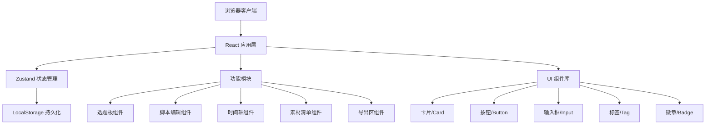
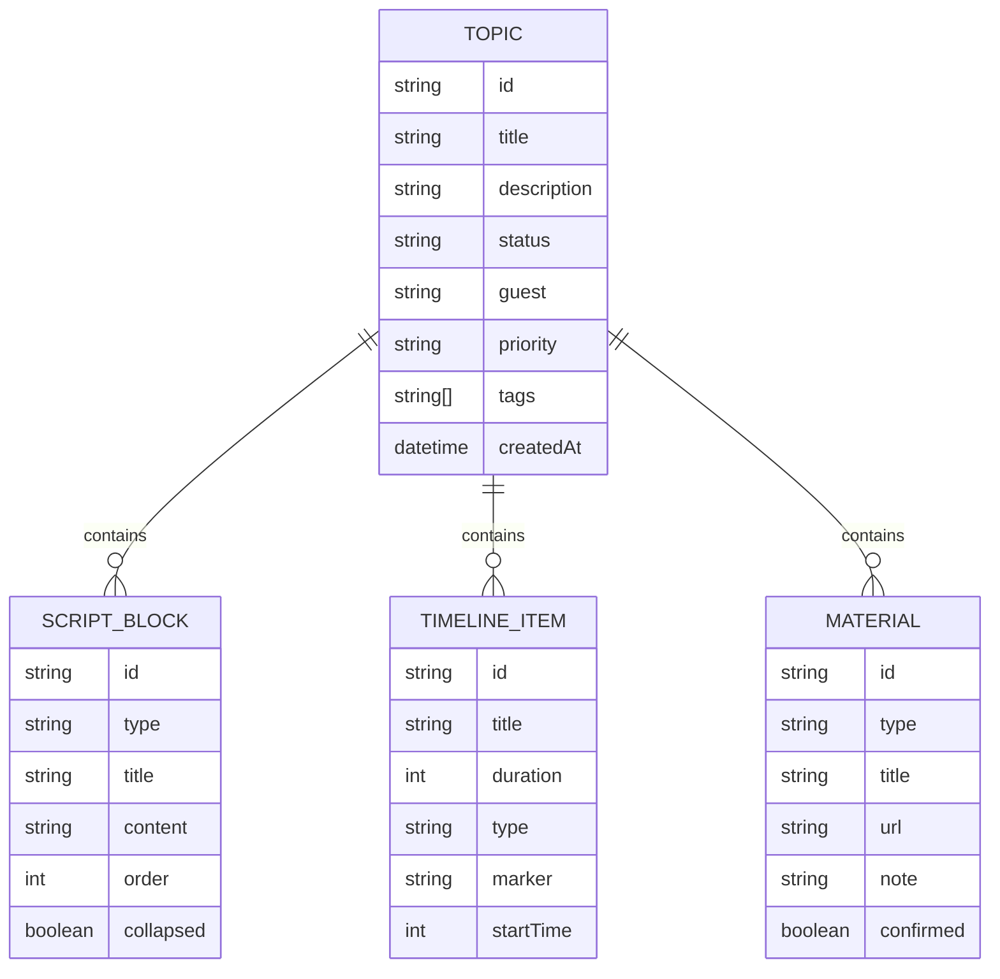

## 1. 架构设计



## 2. 技术描述

- **前端框架**：React@18 + TypeScript
- **构建工具**：Vite@5
- **样式方案**：TailwindCSS@3
- **状态管理**：Zustand
- **图标库**：Lucide React
- **拖拽库**：@dnd-kit/core + @dnd-kit/sortable
- **后端**：无（纯前端应用）
- **数据库**：浏览器 LocalStorage
- **数据存储**：JSON 格式本地持久化

## 3. 目录结构

```
src/
├── components/           # 可复用组件
│   ├── ui/              # 基础UI组件
│   │   ├── Button.tsx
│   │   ├── Card.tsx
│   │   ├── Input.tsx
│   │   ├── Textarea.tsx
│   │   ├── Tag.tsx
│   │   └── Badge.tsx
│   ├── TopicBoard/      # 选题板模块
│   │   ├── TopicColumn.tsx
│   │   ├── TopicCard.tsx
│   │   └── TopicForm.tsx
│   ├── ScriptEditor/    # 脚本编辑模块
│   │   ├── ScriptSection.tsx
│   │   └── ScriptBlock.tsx
│   ├── Timeline/        # 时间轴模块
│   │   ├── TimelineTrack.tsx
│   │   └── TimelineItem.tsx
│   ├── MaterialList/    # 素材清单模块
│   │   └── MaterialItem.tsx
│   └── ExportPanel/     # 导出区模块
│       └── ExportButtons.tsx
├── store/               # 状态管理
│   └── usePodcastStore.ts
├── types/               # TypeScript 类型定义
│   └── index.ts
├── utils/               # 工具函数
│   ├── storage.ts
│   └── export.ts
├── hooks/               # 自定义Hooks
│   └── useLocalStorage.ts
├── App.tsx              # 主应用组件
├── main.tsx             # 入口文件
└── index.css            # 全局样式
```

## 4. 数据模型

### 4.1 数据模型定义



### 4.2 TypeScript 类型定义

```typescript
export type TopicStatus = 'todo' | 'in-progress' | 'done';
export type Priority = 'low' | 'medium' | 'high';
export type ScriptBlockType = 'opening' | 'question' | 'ad' | 'closing';
export type TimelineItemType = 'talk' | 'music' | 'ad';
export type MaterialType = 'link' | 'reference' | 'todo';

export interface Topic {
  id: string;
  title: string;
  description: string;
  status: TopicStatus;
  guest: string;
  priority: Priority;
  tags: string[];
  createdAt: string;
}

export interface ScriptBlock {
  id: string;
  topicId: string;
  type: ScriptBlockType;
  title: string;
  content: string;
  order: number;
  collapsed: boolean;
}

export interface TimelineItem {
  id: string;
  topicId: string;
  title: string;
  duration: number;
  type: TimelineItemType;
  marker?: 'music' | 'voiceover';
  startTime: number;
}

export interface Material {
  id: string;
  topicId: string;
  type: MaterialType;
  title: string;
  url?: string;
  note?: string;
  confirmed: boolean;
}

export interface PodcastState {
  topics: Topic[];
  scriptBlocks: ScriptBlock[];
  timelineItems: TimelineItem[];
  materials: Material[];
  activeTopicId: string | null;
}
```

## 5. 状态管理设计

```typescript
// Zustand Store 结构
interface PodcastStore {
  // State
  topics: Topic[];
  scriptBlocks: ScriptBlock[];
  timelineItems: TimelineItem[];
  materials: Material[];
  activeTopicId: string | null;
  
  // Topic Actions
  addTopic: (topic: Omit<Topic, 'id' | 'createdAt'>) => void;
  updateTopic: (id: string, updates: Partial<Topic>) => void;
  deleteTopic: (id: string) => void;
  moveTopic: (id: string, newStatus: TopicStatus) => void;
  setActiveTopic: (id: string | null) => void;
  
  // Script Actions
  addScriptBlock: (block: Omit<ScriptBlock, 'id'>) => void;
  updateScriptBlock: (id: string, updates: Partial<ScriptBlock>) => void;
  deleteScriptBlock: (id: string) => void;
  reorderScriptBlocks: (topicId: string, blocks: ScriptBlock[]) => void;
  
  // Timeline Actions
  addTimelineItem: (item: Omit<TimelineItem, 'id'>) => void;
  updateTimelineItem: (id: string, updates: Partial<TimelineItem>) => void;
  deleteTimelineItem: (id: string) => void;
  
  // Material Actions
  addMaterial: (material: Omit<Material, 'id'>) => void;
  updateMaterial: (id: string, updates: Partial<Material>) => void;
  deleteMaterial: (id: string) => void;
  toggleMaterialConfirmed: (id: string) => void;
  
  // Export Functions
  exportRecordingOutline: (topicId: string) => string;
  exportGuestQuestions: (topicId: string) => string;
  exportPublishDescription: (topicId: string) => string;
}
```

## 6. 关键技术决策

1. **拖拽实现**：使用 @dnd-kit 实现选题看板拖拽和脚本块排序，性能更好且支持触摸设备
2. **数据持久化**：使用 Zustand persist 中间件，自动同步到 LocalStorage
3. **响应式设计**：TailwindCSS 断点驱动，桌面优先
4. **组件拆分**：每个功能模块拆分为独立组件，单一职责，便于维护
5. **类型安全**：全链路 TypeScript 类型定义，避免运行时错误
6. **无依赖构建**：纯前端实现，无需后端服务，开箱即用
